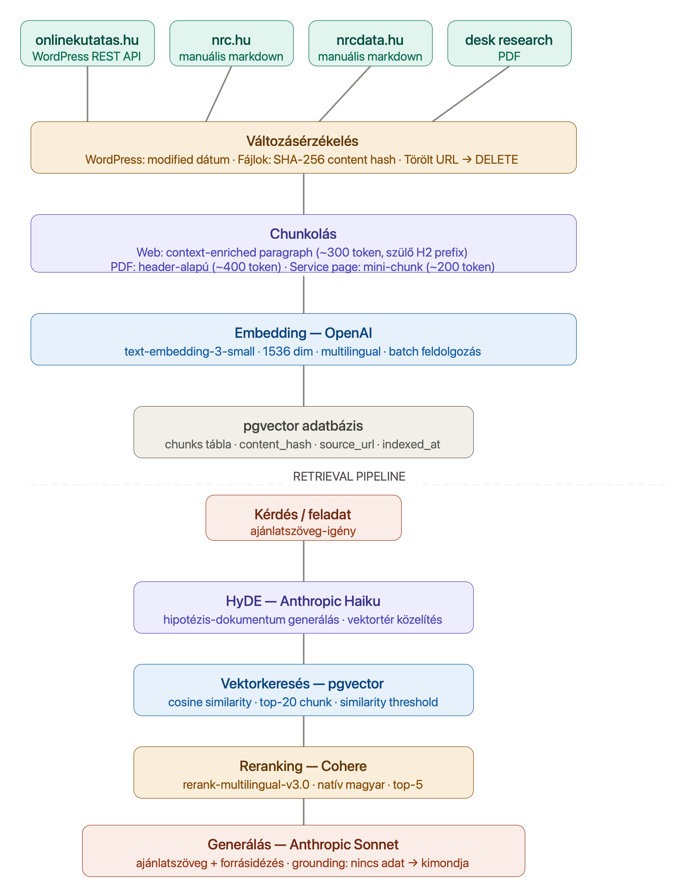

# NRC RAG Agent — Architektúra specifikáció

## A tudásbázis karbantartásának terve

### Forrásstruktúra

A tudásbázis négy forrásból áll, eltérő változási ütemmel:

| Forrás | Típus | Változási ütem |
|---|---|---|
| onlinekutatas.hu | WordPress REST API | Havi 1-2 új poszt |
| nrc.hu | Manuális markdown | Ritka, negyedéves |
| nrcdata.hu | Manuális markdown | Aktívan épül |
| Desk research | PDF | Évi 1-2 verzió |

---

### Változásérzékelés — hogyan tudjuk, hogy változott egy dokumentum?

**WordPress (onlinekutatas.hu):**
A REST API minden dokumentumnál visszaad egy `modified` mezőt (ISO dátum).
Az ingest pipeline eltárolja ezt az értéket. Következő futásnál összehasonlítja
a tárolt és az aktuális `modified` értéket — ha egyezik, a dokumentumot kihagyja.
Ezen felül minden chunk tartalmaz egy `content_hash` (SHA-256) mezőt:
ha a `modified` dátum változott de a tartalom nem (pl. csak metaadat frissült),
a hash alapján elkerüljük a felesleges újravektorizálást.

**Manuális markdown és PDF:**
Fájl szintű SHA-256 hash összehasonlítás. Az ingest futtatásakor
a pipeline kiszámolja a fájl hashét és összehasonlítja a tárolt értékkel.
Ha egyezik → kihagyja. Ha különbözik → törli a régi chunkokat és újraindexeli.

---

### Mi történik egy új dokumentummal?

1. A forrás változásérzékelő észleli az új URL-t vagy fájlt
2. Szöveg kinyerés (HTML→Markdown vagy PDF→szöveg)
3. Chunkolás a forrás típusának megfelelő stratégiával
4. Embedding (OpenAI text-embedding-3-small)
5. Tárolás pgvector-ban, `indexed_at` timestamp-pel

---

### Mi történik egy törölt dokumentummal?

Az ingest pipeline minden futásnál összeveti az aktuális forrás URL-listát
a tárolt `source_url` értékekkel. Amelyik URL már nem létezik a forrásban,
annak minden chunkját törli az adatbázisból:

```sql
DELETE FROM chunks WHERE source_url = :url AND source_name = :source;
```

---

### Mi triggeri az újraindexelést?

| Trigger | Módszer |
|---|---|
| Ütemezett (heti) | Cron job: `python ingest_run.py` |
| Manuális | `python ingest_run.py --force` (teljes újraindexelés) |
| CI/CD | GitHub Action PR merge után automatikusan |

Az `--force` flag nélküli futás csak a változott dokumentumokat dolgozza fel
(`skip_existing=True` alapértelmezés a `content_hash` alapján).

---

### Architektúra ábra



Az ábra a teljes adatfolyamot mutatja:
- Bal oldal: forrás → változásérzékelés → chunk → embed → tárolás
- Jobb oldal: törlés/módosítás útja
- Középen: a retrieval pipeline (HyDE → embed → pgvector → rerank → generate)

---

### Kockázatok és korlátok

**Manuális tartalom:** Az nrc.hu és nrcdata.hu manuális másolással kerül be —
nincs automatikus változásérzékelés. Megoldás: negyedéves manuális felülvizsgálat,
vagy hosszabb távon az oldalak crawlolhatóvá tétele (robots.txt módosítás).

**Embedding konzisztencia:** Ha modellt váltunk (pl. text-embedding-3-small →
text-embedding-3-large), a teljes tudásbázist újra kell vektorizálni, mert
a különböző modellek vekterei nem kompatibilisek egymással.

---

## Golden set eredmények értelmezése

**Raw pipeline (csak embedding + cosine similarity): 5/6 helyes**
A Q6 kérdésnél ("Mi az NRC konkrét árazása?") a nyers keresés azt mondta, van válasz — holott nincs. Ez a grounding hiányát mutatja: a vektorkeresés talált hasonló szövegrészletet (Netpanel leírást), de az nem tartalmaz árazást.

**Teljes pipeline (HyDE + rerank + grounding): 6/6 helyes**
A Q6-nál a reranking után a generator helyesen állapította meg, hogy a visszahozott chunkokban nincs árainformáció, és kimondta: "A rendelkezésre álló tudásbázisban nincs elegendő információ erről." Ez a grounding működésének bizonyítéka — a rendszer nem talál ki tartalmat.

**Következtetés:** A HyDE + rerank kombináció nemcsak jobb sorrendet ad, hanem megakadályozza a hamis pozitív válaszokat is, ami ajánlatírás kontextusban kritikus (NRC nem adhat hamis árakat vagy nem létező szolgáltatásokat).
